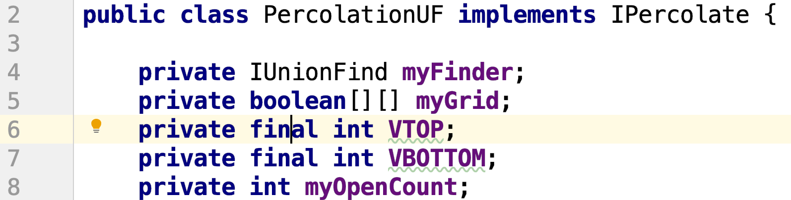

# Project 6: Percolation

This is the directions document for Project P6 Percolation in CompSci 201 at Duke University, Spring 2022. Please follow the directions carefully while you complete the project. Please refer to the directions at https://coursework.cs.duke.edu/201spring22/p6-percolation rather than any forks or local copies in the event that any changes are made to the document.

## Outline 
- [Project Introduction](#project-introduction)
- [Part 1: `PercolationDFSFast`](#part-1-percolationdfsfast)
- [Part 2: `PercolationBFS`](#part-2-percolationbfs)
- [Part 3: `PercolationUF`](#part-3-percolationuf)
- [Benchmarking and Analysis](#benchmarking-and-analysis)
- [Submitting, Reflect, and Grading](#submitting-reflect-and-grading)


## Project Introduction

In this assignment, you will write a program to estimate the value of the [percolation threshold](http://en.wikipedia.org/wiki/Percolation_thresholds) via [Monte Carlo](http://en.wikipedia.org/wiki/Monte_Carlo_method) simulation. In doing so, you will better understand depth-first-search, breadth-first-search, union-find structures, and the use of computer simulations for statistical inquiry. _**Your goal will be to explore trade-offs in several approaches to estimate the percolation threshold in an NxN system.**_ 

<details>
<summary>Acknowledgements</summary>
This assignment originated at Princeton; thanks to Kevin Wayne from whom staff at Duke first learned of it, and to Jeff Forbes when he was at Duke for ensuring we kept it as part of the assignment-stack at Duke.
</details>


### Vocabulary
In a system of rectangular/square NxN grid cells, each cell is sometimes referred to as a _site_ in the assignment and in supporting material, including this background.
- All sites start as **blocked**
- When a site is chosen at random it is **open**
- Open sites connected to the top row are **full**.
- A system in which there's a full cell in the bottom row (and thus a path of full cells from top to bottom) **percolates**.

Given a porous landscape with water on the surface (or oil below), under what conditions will the water be able to drain through to the bottom (or the oil to gush through to the surface)? Given a composite system composed of randomly distributed insulating and metallic materials, what fraction of the materials need to be metallic so that the composite system is an electrical conductor? Scientists have defined an abstract process known as percolation to model such situations.

We model a percolation system using an N-by-N grid of sites. **Each site is either open or blocked. A full site is an open site that can be connected to an open site in the top row via a chain of neighboring (left, right, up, down) open sites.** In diagrams we color full sites blue to model water flowing from the top through the system. We say the **system percolates if there is at least one full site in the bottom row.** In other words, a system percolates if there is a path of open sites from the top row to the bottom row. For the porous substance example, the open sites correspond to empty space through which water might flow, so that a system that percolates lets water fill open sites, flowing from top to bottom.

For more on percolation see the [Princeton Case Study](http://introcs.cs.princeton.edu/java/24percolation/).


### Percolation Threshold
The percolation threshold problem is: if sites are independently set to be open with probability p (and therefore blocked with probability (1 − p), what is the probability that the system percolates? In other words, in a N-by-N grid, would the system percolate if N^2 randomly chosen cells are opened?  When p equals 0, the system does not percolate; when p equals 1, the system percolates. The plots below show the site vacancy probability p versus the percolation probability for 20-by-20 random grid (left) and 100-by-100 random grid (right).


When N is sufficiently large, there is a threshold value p* such that when p < p* a random N-by-N grid almost never percolates, and when p > p*, a random N-by-N grid almost always percolates. No mathematical solution for determining the percolation threshold p* has yet been derived. Your task is to write a suite of computer programs to visualize the percolation process and estimate p* using Monte Carlo techniques. As you can see above, the percolation threshold in an NxN grid is about 0.593. The size of the grid doesn't matter as your simulations will show. 

### Helpful Videos 
The videos linked here show (1) an interactive simulation where you choose to open sites and (2) help explain the techniques you'll read about. These videos may be helpful after reading the assignment, or to get grounded before reading. These videos help understand two parts of the assignment.

1. [Open, full, DFS, and what percolation means](https://www.youtube.com/watch?v=ikVIiuCR4pk)
2. [From DFS to Union-Find: two approaches compared/contrasted](https://www.youtube.com/watch?v=lpYvgV5m1qM)

### MazeDemo
The program `MazeDemo.java` within the project you get (`src/MazeDemo.java`) is a model for DFS, BFS, and Union-Find.  You should study the program to reinforce your understanding of these concepts. Two videos of solving a maze using DFS and BFS, respectively, can be found linked below, looking at them and the source code for `MazeDemo.java` may help in understanding how the two searches work.

- [dfs maze](https://www.youtube.com/watch?v=95igA_fWQtc)
- [bfs maze](https://www.youtube.com/watch?v=dffMgIjfczI)

### Overview: What to Do

Here's a high-level view of the assignment. This is enough information to know what to do, but not necessarily how to do it. For details, you can refer to sections later in this write-up.

You'll create three new implementations of the `IPercolate` interface that you'll test, time, and answer questions about in analyzing tradeoffs. 
1. Create class `PercolationDFSFast` that extends `PercolationDFS`. Implement constructors appropriately. You only have to `@Override` the method `updateOnOpen`. 
2. Create class `PercolationBFS` that extends `PercolationDFSFast`. Implement constructors appropriately. You only have to `@Override` one method: `search` to implement BFS instead of DFS. 
3. Create class `PercolationUF` that implements the `IPercolate` interface. Implement a constructor and every method from the interface. Instance variables and methods are described in the write-up and include a grid/two-dimensional array of boolean values, an `IUnionFind` object `myFinder`, and a few int types. You'll use the union-find methods from the IUnionFind object as described in the video above.

For all three classes, test the implementation using the JUnit test class `TestPercolate` by changing which of the three implementations is used. You *must* also test using the `InteractivePercolationVisualizer` simulating the percolation using your own click-tests. **Do not depend only on the JUnit tests.**

For the analysis you will run `PercolationStats` and answer the analysis questions. 

### Starter Code and Using Git
You must have installed all software (Java, Git, VS Code) before you can complete the project.You can find the [directions for installation here](https://coursework.cs.duke.edu/201-public-documentation/resources-201/-/blob/main/installingSoftware.md).

We'll be using Git and the installation of GitLab at [coursework.cs.duke.edu](https://coursework.cs.duke.edu). All code for classwork will be kept here. Git is software used for version control, and GitLab is an online repository to store code in the cloud using Git.

**[This document details the workflow](https://coursework.cs.duke.edu/201-public-documentation/resources-201/-/blob/main/projectWorkflow.md) for downloading the starter code for the project, updating your code on coursework using Git, and ultimately submitting to Gradescope for autograding.** We recommend that you read and follow the directions carefully while working on a project! While coding, we recommend that you periodically (perhaps when completing a method or small section) push your changes as explained in Section 5.


## Part 1 `PercolationDFSFast`
Your new class `PercolationDFSFast` will extend `PercolationDFS` and thus inherit state and methods from that class. That class has protected state, so can be extended.

1. You'll need to create a constructor with an int/size parameter whose only code is a call to `super(..)` to initialize the state in the parent class. 
2. You'll need to `@Override` `updateOnOpen` to be more efficient.

In the `updateOnOpen` in `PercolationDFS` all cells marked as **FULL** are “cleared” or changed so that they're marked as **OPEN**, then the method `search` is called from every cell on the top row. Calling `search` on any open cell will explore all paths from that cell and mark all open cells as **FULL**. This is very inefficient since cells marked as **FULL** are cleared each time a new cell is opened, then marked as **FULL**, then cleared and the process repeats for each newly open cell, e.g., in a simulation.

You'll change this method so it does **not** clear all cells, but instead calls `search` once *if* the newly open cell should be marked as **FULL** because it's in the top row or because it's adjacent to an already **FULL** cell.

1. Determine if the newly open cell (parameters `row` and `col` of `updateOnOpen`) should be marked as full. To check:
  - Is the cell in the top row? If so, it should be marked as full. 
  - Is the cell adjacent to a full cell? If so it should be marked as full.
2. If the cell should be marked as full, call `search(row,col)`.

Note that you'll make one call of `search`. _**The `search` method is inherited from `PercolationDFS` (it performs a depth first search) and does not change. You must call `search` and NOT super.search in the code you write.**_ The `search` implementation will mark an open cell as **FULL** and make recursive calls for each neighbor. The `search` implementation checks for cells already marked as **FULL** or that are not **OPEN** and does not visit these cells.

### Testing `PercolationDFSFast`
To test this program you will need to:

3. Use  `InteractivePercolationVisualizer`,but you will need to change the line in `main` between lines 22-25 to create a `perc` object of type `PercolationDFSFast`  and then run this simulator to make sure it works.
4. Modify and run `TestPercolation`. You will need to change the method `getPercolator` to return a `PercolationDFSFast` object.


## Part 2: `PercolationBFS`
This class extends the `PercolationDFSFast` class you wrote previously. You'll override the `search` method inherited from `PercolationDFS` to use a `Queue` and a breadth-first-search (BFS) approach. Use the ideas from the [BlobCounting code](https://coursework.cs.duke.edu/201spring22/blobcounting) we've seen in class, especially the [BFSBlobModel](https://coursework.cs.duke.edu/201spring22/blobcounting/-/blob/main/src/BFSBlobModel.java). The `search` method you write _**will be called from the inherited `updateOnOpen` from `PercolationDFSFast.`**_

1. You'll need to create a `PercolationBFS` constructor with an int/size parameter that calls super to initialize the state in the parent class.
2.  You'll need to `@Override` `search` to use a `Queue` as explained below.


**Important note: The `search` method will mark an open cell as full and then proceed to mark the open cells connected to that cell as full. As a result, you should terminate the method early (return ;) if the cell is full or blocked before creating the Queue.**

Create a `Queue<int[]>` from a LinkedList object since that class implements the Queue interface. Whereas the original dfs used recursion, this method will first mark the cell at `myGrid[row][col]` as **FULL** and put the cell on the queue using something like `q.add(new int[]{row,col})`.  Then repeat the following process:
- Dequeue a cell. (All cells in the queue should have been marked as **FULL**).
- Check the dequeued cell’s four neighbors. _**If the neighboring cell is open and not full, it should be marked as full and enqueued.**_ This is similar to the check in the recursive dfs method where cells that are marked as open but not full are visited by the recursive call.

### Testing `PercolationBFS`
To test this program you will need to:
3. Use  `InteractivePercolationVisualizer`,but you will need to change the line in `main` between lines 22-25 to create a `perc` object of type `PercolationBFS` and then run this simulator to make sure it works.
4. Modify and run `TestPercolation`. You will need to change the method `getPercolator` to return a `PercolationBFS` object.


## Part 3: `PercolationUF`
This class `implements` the `IPercolate` interface and will use an `IUnionFind` object to keep track of open and full cells. See the video at the beginning of the assignment for general ideas. You can also look at the `MazeDemo` class in the Percolate assignment to see how union-find can be used. 

Each of the NxN cells is mapped to a number, and these numbers represent a cell's set for the disjoint-set/union-find algorithm. Initially every cell is a single number in its own set. You'll need two additional numbers, `VTOP` and `VBOTTOM`, for a total of N<sup>2</sup>+2 values.

### Instance variables for PercolationUF
1. A two-dimensional array of boolean values, `myGrid`, that represents whether a cell is open. Initially `myGrid[r][c]` should be `false` which is the default value when you create the grid. Each time a cell (r,c) is open, `myGrid[r][c]` will be set to true.
2. An integer `myOpenCount` which is the number of open cells, i.e., the number of true values in `myGrid`.
3. An `IUnionFind` object `myFinder` to store/reference the `IUnionFind` object passed to the constructor (which should be a `QuickUWPC` object in this assignment, you will see this later when you test it).
4. Two final values for `VTOP` and `VBOTTOM`, set to `size * size` and `size * size + 1`, for example, in the constructor. All instance variables should be private as shown.



### Constructor for `PercolationUF`
Create a constructor `PercolationUF(IUnionFind finder, int size)` that will construct and initialize the NxN grid stored in the instance variable `myGrid` (where N is given by the `size` parameter). The constructor should initialize the `IUnionFind` object **of size NxN + 2** by calling `finder.initialize` appropriately and then storing this object in the appropriate instance variable which is `myFinder`.  Also initialize the remaining instance variables. This will be a total of five or six lines to initialize each of the five instance variables.

### Methods for `PercolationUF`
You must `@Override` each method from the `IPercolate` interface. As with methods you can see in `PercolationDFS`, these methods you write with (row,col) parameters should throw exceptions when the (row,col) are not in bounds. You may find it convenient to create your own **private or protected** helper method `inBounds` to make these checks as in `PercolationDFS`.

The `IUnionFind` classes use a single integer value to represent each set used in all methods like `find, union, connected`, and so on. You'll need to convert a (row,col) pair to a single integer. The simplest way to do this is to use `row*myGrid.length + col` -- you can see that this maps (0,0) to 0, and in a 10x10 grid will map (0,9) to 9, and (1,9) to 19.  

Be sure to deal with `VTOP` and `VBOTTOM` as well.

1. Method `isOpen` throws an `IndexOutOfBoundsException` (see `PercolationDFS` for example) when needed and otherwise simply returns the appropriate `myGrid` value.
2. Method `isFull` throws an `IndexOutOfBoundsException` (see `PercolationDFS` for example) when needed and otherwise checks if the (row,col) cell is connected to `VTOP` (convert (row,col) to an integer to call `myFinder.connected`).
3. Method `percolates` checks to see if `VTOP` is connected to `VBOTTOM` using `myFinder`.
4. Method `numberOfOpenSites` simply returns the value of the appropriate instance variable.
5. Method `open` throws an Exception when needed, checks to be sure the cell is not already open, and then marks the cell as open and connects with open neighbors as described below.

When a cell is marked as open, you'll write code to check each of the cell's four neighbors. If any of these cells is open, the newly marked cell and the open neighbor should be connected by a call to `myFinder.union`. If the newly marked cell is in the top row it should be connected to `VTOP` by a call to `myFinder.union`. If the newly marked cell is in the bottom row it should be connected to `VBOTTOM` by a call to `myFinder.union`.

### Testing `PercolationUF`
To test this program you will need to:
1. Use  `InteractivePercolationVisualizer`,but you will need to change the line in `main` between lines 22-25 to create a `perc` object of type `PercolationUF`,  and create an appropriate `IUnionFind` object, then run this simulator to make sure it works.
2. Modify and run `TestPercolation`. You will need to change the method `getPercolator` to return a `PercolationUF` object, see the code commented out in that method.


## Benchmarking and Analysis

Copy/Paste the runs described below and answer the questions that are included below. You will answer these questions in a separate PDF document you submit to gradescope.

You're given `PercolationStats.java` which performs benchmarks for an `IPercolate` object using grid sizes of 100, 200, 400, 800, 1600, and 3200. If you don't change the value of the public `RANDOM_SEED` variable you should _**see the same mean values**_ of the Percolation threshold shown below. Your timing values may vary, but for all implementations using 20 trials you should see the same mean and standard deviation values. A sample run is provided below from running `PercolationDFSFast` on a head UTA’s computer. _**You will eventually reach a StackOverflowError because you’re running an infinite benchmark on a computer with finite memory. This is normal!**_

<details>
<summary>Expand for example simulation data</summary>

```
simulation data for 20 trials
grid    mean    stddev    total time
100    0.593    0.014    0.160
200    0.591    0.010    0.194
400    0.590    0.006    1.249
800    0.594    0.004    6.003
Exception in thread "main" java.lang.StackOverflowError
    at PercolationDFS.dfs(PercolationDFS.java:109)
    at PercolationDFS.dfs(PercolationDFS.java:109)
    at PercolationDFS.dfs(PercolationDFS.java:109)
    at PercolationDFS.dfs(PercolationDFS.java:110)
    at PercolationDFS.dfs(PercolationDFS.java:109)
    [... rest truncated]
```
</details>

Copy/paste the results for running `PercolationStats.java` for 20 trials on each `IPercolate` object (`PercolationDFSFast, PercolationBFS, PercolationUF`) in your analysis document. 

So first copy/paste data for the grid sizes shown above for all three `IPercolate` classes you implement for this project. Then answer these questions using data from `PercolationUF` with `QuickUWPC`.
1. How does doubling the grid size affect running time (keeping # trials fixed)? Specifically, by roughly what factor does the runtime increase each time we double the grid size?
2. How does doubling the number of trials affect running time? Specifically, by roughly what factor does the runtime increase each time we double the number of trials?
3. Based on your observations of the timings with 20 trials, estimate the largest grid size you can run completely in at most 24 hours with 20 trials. Explain your reasoning.
4. Read this brief opinion article: [Cho and Cain, _Human-centered redistricting automation in the age of AI+, Science, September 2020](https://courses.cs.duke.edu/compsci201/fall21/netid/science-abd1879.pdf) about using statistical and computational techiques similar to those used in this assignment for socio-technical problems such as congressional districting. Write a paragraph about your thoughts after reading the article about the relationship between computational techniques and societal applications.

_**After completing the analysis questions you should submit your answers as a PDF to the P6-analysis project on Gradescope.**_

## Submitting, Reflect, and Grading

Push your code to Git. Do this often. Once you have run and tested your completed program locally:

1. Submit your code on gradescope to the autograder.
2. Submit a PDF to Gradescope in the separate Analysis assignment. Be sure to mark pages for the questions as explained in the [gradescope documentation here](https://help.gradescope.com/article/ccbpppziu9-student-submit-work#submitting_a_pdf).
3. Complete the [reflect form linked here](https://forms.office.com/Pages/ResponsePage.aspx?id=TsVyyzFKnk2xSh6jbfrJTErNjWEU70pGg_ytfEVEPi5UQVA5V1NVUUk3SktHTFI2MEVFT1MzMUNXQS4u).

For this project, the grading will be:

| Points | Grading Criteria |
| --- | --- |
| 6 | PercolationDFSFast |
| 6 | PercolationBFS |
| 6 | PercolationUF |
| 1 | API Check - make sure your code implements the correct methods |
| 7 | Analysis and reflect |

# Autograder API Checker
We use an API checker to check that you implement the appropriate instance variables and methods for each method. Attached below is a sample output response from a head UTA’s test submission. 


In order to resolve this issue, make sure that if you’ve added any instance variables or helper methods not specified in the writeup that you change them to private. 
